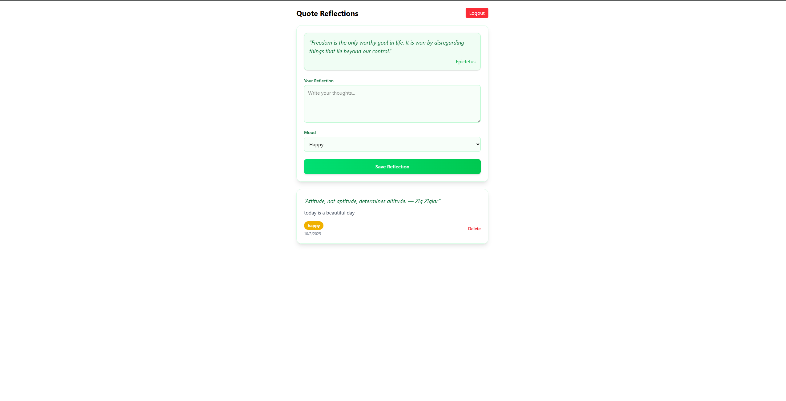

# Reflections App
A simple full-stack learning journaling app where users can **sign up, sign in, and write daily reflections** inspired by random quotes. Built with **React, Express, Supabase, and TailwindCSS**. Simple learning project used to learn the flow of code :)

## Features
- User authentication (sign up / sign in with Supabase)  
- Write reflections tied to your account  
- Random motivational quote for inspiration  
- Mood selection (Happy, Calm, Stressed, Sad, Excited)  
- Each reflection is timestamped  
- Delete reflections with instant UI updates  
- Clean, nature-inspired design using TailwindCSS  

## Tech Stack
**Frontend:**  
- React (Vite)  
- TailwindCSS  

**Backend:**  
- Node.js + Express  
- Supabase (Auth + Database)  
- REST API routes for CRUD operations  

**Database (Supabase Table `reflections`):**  
- `id` (primary key)  
- `user_id` (FK → Supabase auth user)  
- `quote` (string)  
- `reflection_text` (string)  
- `mood` (string)  
- `entry_date` (timestamp, default: now)  

## Small Glimpse :)

  

